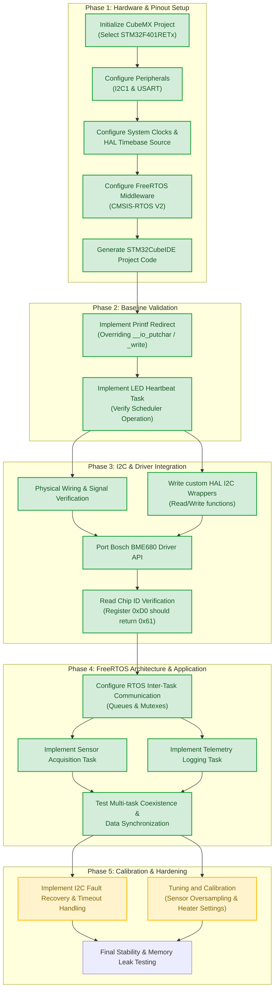
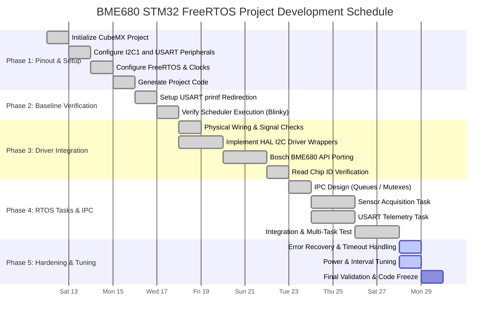

# BME680 Sensor Integration on STM32F401RE (Nucleo-64)
## Project Development Workflow & Technical Outline

This document details the step-by-step workflow for integrating a BME680 gas/environmental sensor with the STM32F401RE microcontroller on a Nucleo-64 board using I2C communication under the FreeRTOS real-time operating system. 

---

## 1. System Architecture & Pinout Recommendation

### Core Hardware Specifications
*   **Microcontroller:** STM32F401RET6 (Cortex-M4, 84 MHz, 512 KB Flash, 96 KB SRAM).
*   **Sensor:** Bosch Sensortec BME680 (Temperature, Pressure, Relative Humidity, Gas/VOC resistance).
*   **Operating System:** FreeRTOS (integrated via CMSIS-RTOS V2).
*   **Communication Protocols:**
    *   **I2C1:** For communicating with the BME680 sensor.
    *   **USART1 / USART2:** For telemetry, log output, and CLI debug shell.

### Recommended Pin Configurations

| Interface | Signal | Nucleo-64 Pin | MCU Pin | Notes |
| :--- | :--- | :--- | :--- | :--- |
| **I2C1** | SCL | D15 (CN5 pin 10) | `PB8` | Standard / Fast Mode (100 / 400 kHz). Pull-up resistors required (typically 4.7 kΩ, often on the BME680 breakout). |
| **I2C1** | SDA | D14 (CN5 pin 9)  | `PB9` | |
| **USART2** | TX | Virtual COM Port | `PA2` | **Recommended for debugging:** On the Nucleo board, `PA2` and `PA3` are routed directly to the ST-LINK microcontroller's Virtual COM Port, allowing USB serial logging without external cables. |
| **USART1** | TX | D8 (CN9 pin 1)   | `PA9` | Configure this only if you are using an external USB-to-UART interface. |
| **USART1** | RX | D2 (CN9 pin 5)   | `PA10`| |
| **Power** | 3.3V | CN6 pin 4        | - | Powers the BME680 breakout. |
| **Ground**| GND  | CN6 pin 6 or 7   | - | Ground reference. |

> [!WARNING]
> **HAL Timebase Source:** Since FreeRTOS uses the `SysTick` timer for its scheduler tick, you **must** change the HAL Timebase Source in STM32CubeMX under **System Core -> SYS** to a hardware timer (e.g., `TIM1` or `TIM5`) instead of `SysTick`. Failing to do this can cause resource conflicts and scheduler lockups.

---

## 2. Dependency Flowchart

The following flowchart illustrates the prerequisite relationships between tasks, showing how hardware and driver setups must complete before task scheduler design and system hardening.


----

## 3. Project Gantt Chart

The Gantt chart below schedules the development process across 5 phases. The critical path runs from initial pinout setup through validation of the I2C physical layer, before moving to parallel task development.



---

## 4. Phase-by-Phase Execution Details

### Phase 1: Hardware & Pinout Setup (STM32CubeMX)
Set up the hardware peripherals, clock tree, and RTOS configurations in STM32CubeMX.

1.  **MCU Selection:** Start a new project for `STM32F401RETx` (Nucleo-F401RE board option recommended).
2.  **I2C1 Peripheral:** 
    *   Enable I2C1 as "I2C".
    *   Speed Mode: Standard Mode (100 kHz) for safety, or Fast Mode (400 kHz) if shorter communication windows are needed.
    *   Pins: Ensure PB8 (SCL) and PB9 (SDA) are selected (standard Arduino-R3 layout mapping on Nucleo).
3.  **USART Peripheral:**
    *   Enable `USART2` as Asynchronous.
    *   Baud Rate: `115200 Bits/s`, Word Length: `8 Bits`, Stop Bits: `1`, Parity: `None`.
4.  **FreeRTOS Middleware:**
    *   Enable FreeRTOS, selecting Interface `CMSIS_V2` (recommended).
    *   Leave default task (`defaultTask`) configured at normal priority.
5.  **System Core Config:**
    *   **SYS:** Set Timebase Source to `TIM5` (or any general-purpose timer other than `SysTick`).
    *   **RCC:** High Speed Clock (HSE) set to Bypass Clock Source (the 8 MHz oscillator is bypassed from the ST-LINK MCU).
    *   Verify System Clock configuration runs at the maximum `84 MHz`.
6.  **Code Generation:** Set Toolchain/IDE to `STM32CubeIDE` and generate the project.

### Phase 2: Baseline & Toolchain Verification
Verify that the workspace is operational and print/scheduler mechanisms function correctly.

1.  **USART stdout Retargeting:**
    *   In `main.c`, override the standard I/O redirection functions so that `printf()` statements route to USART2.
    *   For GCC (STM32CubeIDE), implement:
        ```c
        int __io_putchar(int ch) {
            HAL_UART_Transmit(&huart2, (uint8_t *)&ch, 1, HAL_MAX_DELAY);
            return ch;
        }
        ```
2.  **Blinky Task & Console Output:**
    *   Add a simple `printf("System Initialized...\r\n");` before launching the scheduler.
    *   Modify `StartDefaultTask()` to toggle the onboard LED (LD2 - `PA5`) and output a heartbeat console message every 1000ms using `osDelay()`.
    *   **Verification:** Build, flash, and monitor output using a serial terminal (e.g., PuTTY, Tera Term, or STM32CubeIDE Serial Monitor) at 115200 baud.

### Phase 3: BME680 I2C Driver Integration
Import the manufacturer-supplied driver and establish low-level communication.

1.  **Physical Wiring:**
    *   Connect BME680 VCC to Nucleo `3.3V`.
    *   Connect BME680 GND to Nucleo `GND`.
    *   Connect BME680 SCL to Nucleo `PB8` (D15).
    *   Connect BME680 SDA to Nucleo `PB9` (D14).
    *   *Note:* Verify the breakout board includes 10k or 4.7k ohm pull-up resistors on SDA/SCL lines.
2.  **HAL I2C Wrappers:**
    *   Write the signature-compatible read/write helper functions required by the BME680 driver API:
        ```c
        int8_t user_i2c_read(uint8_t dev_id, uint8_t reg_addr, uint8_t *reg_data, uint16_t len) {
            // dev_id is left-shifted by 1 in STM32 HAL
            if (HAL_I2C_Mem_Read(&hi2c1, dev_id << 1, reg_addr, I2C_MEMADD_SIZE_8BIT, reg_data, len, 100) == HAL_OK) {
                return 0; // Success
            }
            return -1; // Failure
        }

        int8_t user_i2c_write(uint8_t dev_id, uint8_t reg_addr, uint8_t *reg_data, uint16_t len) {
            if (HAL_I2C_Mem_Write(&hi2c1, dev_id << 1, reg_addr, I2C_MEMADD_SIZE_8BIT, reg_data, len, 100) == HAL_OK) {
                return 0; // Success
            }
            return -1; // Failure
        }

        void user_delay_ms(uint32_t period) {
            osDelay(period); // Use RTOS delay instead of block-waiting HAL_Delay
        }
        ```
3.  **Bosch Driver Porting:**
    *   Add `bme680.c` and `bme680.h` (from Bosch's official BME680 driver repository) into `/Core/Src` and `/Core/Inc`.
    *   Initialize the BME680 structure in code, linking your I2C read/write/delay function pointers to the structure elements.
4.  **Chip ID Verification:**
    *   Call `bme680_init(&gas_sensor)` which reads the sensor register `0xD0` (Chip ID).
    *   **Verification:** Ensure the initialization function returns success and the read Chip ID is exactly `0x61`.

### Phase 4: FreeRTOS Task Design & Application
Design the multitasking logic to ensure reliable timing and non-blocking operation.

1.  **Inter-Process Communication (IPC):**
    *   Create a struct representing the telemetry data packet:
        ```c
        typedef struct {
            float temperature;
            float humidity;
            float pressure;
            float gas_resistance;
            uint32_t timestamp;
        } BME680_Data_t;
        ```
    *   Initialize a FreeRTOS Message Queue `SensorDataQueue` (capacity: 5 messages, size: `sizeof(BME680_Data_t)`) to pass data from the reader task to the logger task safely.
2.  **Sensor Acquisition Task (`vSensorTask`):**
    *   Priority: `osPriorityNormal`.
    *   Stack Size: `512 words` (2048 bytes).
    *   Configure sensor: Oversampling (Temp x8, Press x2, Humid x1), Gas heater profile (320°C for 150ms).
    *   Loop behavior:
        1. Set mode to Forced Mode (`BME680_FORCED_MODE`).
        2. Wait for measurement duration using `osDelay()` (calculated using driver APIs, ~150-200ms depending on heater profile).
        3. Read sensor data, write to telemetry struct.
        4. Post structure to `SensorDataQueue`.
        5. Sleep (using `osDelay()`) for the remainder of the sampling interval (e.g., 3000ms).
3.  **USART Telemetry Task (`vTelemetryTask`):**
    *   Priority: `osPriorityBelowNormal`.
    *   Stack Size: `256 words` (1024 bytes).
    *   Loop behavior:
        1. Wait indefinitely for data from `SensorDataQueue`.
        2. Once data is received, format the message: `[TS: %lu] T: %.2f C, H: %.2f %%, P: %.2f hPa, G: %.2f Ohms\r\n`.
        3. Print output via USART.

### Phase 5: Calibration & Hardening
Harden the software for long-term operations, handling hardware glitches, and optimizing parameters.

1.  **I2C Fault Recovery:**
    *   Add checks to HAL I2C wrappers. If a transaction returns error or timeout, reinitialize the I2C1 peripheral using `HAL_I2C_Init(&hi2c1)`.
    *   Prevent I2C bus lockups (if SDA gets stuck low, toggle SCL manually up to 9 times to release the slave, then reset).
2.  **Sensor Tuning:**
    *   If using BME680's gas sensor, ensure the gas heater operates correctly. The first few readouts will stabilize as the plate heats up.
    *   Keep sampling intervals steady. Changing the sampling intervals dynamically affects the temperature profile of the sensor's micro-hotplate.
3.  **Memory & Stack Monitoring:**
    *   Enable FreeRTOS stack overflow hook by defining `configCHECK_FOR_STACK_OVERFLOW` as `1` or `2` in `FreeRTOSConfig.h`.
    *   Verify task stack utilization using STM32CubeIDE's "RTOS Viewer" debugger plugin.
